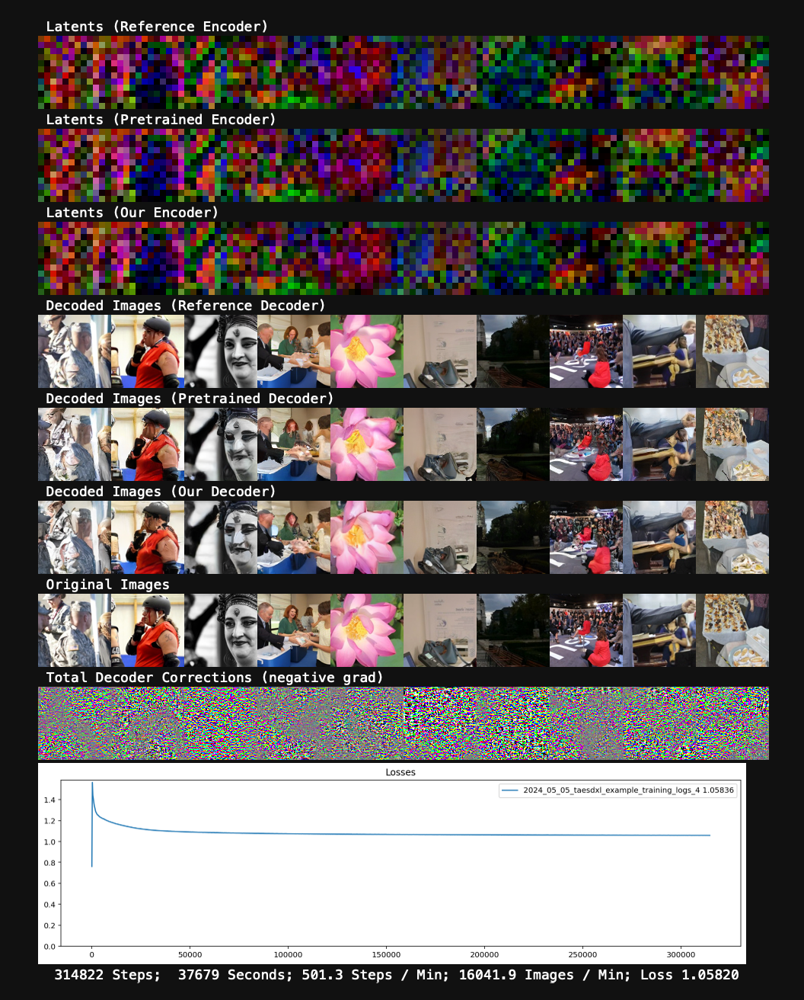

# 🏞️ Seraena

## What is Seraena?

Seraena is 🚧 WIP 🚧 PyTorch code for stably training mode-dropping deterministic latent autoencoders like [TAESD](https://github.com/madebyollin/taesd) using only conditional adversarial loss (without LPIPS/L1 or pretraining).

## What can you do with the Seraena code?

This repo includes an <a href="TAESDXL_Training_Example.ipynb">example TAESDXL training notebook</a> which trains a lightweight single-step decoder for the [SDXL VAE](https://huggingface.co/madebyollin/sdxl-vae-fp16-fix) using Seraena. It also trains a simple (MSE-distilled) encoder for completeness.

If you find any other interesting uses for the Seraena code / models, LMK and I can link them here.

## Are there any pretrained Seraena model checkpoints available?

[Yes.](./checkpoints)

## How does Seraena work?

It's basically the usual PatchGAN discriminator + rescaled gradient setup (just with a [replay buffer](https://github.com/soumith/ganhacks?tab=readme-ov-file#8-use-stability-tricks-from-rl) on generated samples). See [the code](./seraena.py#L45).

## Why is Seraena marked 🚧 WIP 🚧 ?

Although Seraena is quite simple, there are still several YOLO'd hyperparameters and design choices present in the Seraena code (learning rates, batch and replay buffer size, discriminator architecture). I haven't done any serious benchmarking, ablations, or tuning of these choices. I also haven't verified if Seraena can match the full performance of released TAESD or SD-VAE.

If you want a serious, battle-tested autoencoder training repo I recommend looking at the [Stability](https://github.com/Stability-AI/generative-models/blob/main/configs/example_training/autoencoder/kl-f4/imagenet-kl_f8_8chn.yaml) or [MosaicML](https://github.com/mosaicml/diffusion/blob/main/yamls/mosaic-yamls/train-diffusers-autoencoder.yaml) codebases.
